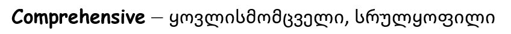
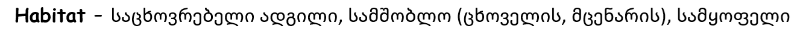

# AcadNusx-substitution

The Python script to replace 'AcadNusx' font in DOCX elements

### Examples:

**#1**

_The incorrect word in **AcadNusx**:_

_The correct word in **Georgian**:_

**#2**

_The incorrect word in **AcadNusx**:_

_The correct word in **Georgian**:_

